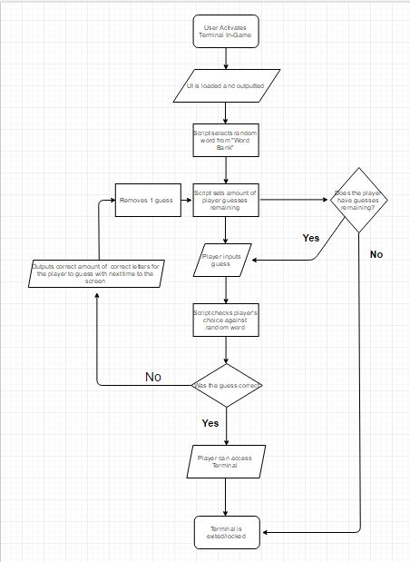

```
START

password = RANDOMLY PICKED FROM BANK/MATRIX
guess_attempts = 0                                    //SETS NUMBER OF PLAYER GUESSES AT LOWEST VALUE

WHILE (guess_attempts<3)                              //ALLOWS LOOP TO RUN WHILE THE PLAYER STILL HAS GUESSES REMAINING
    guessedletter=randomletter                        //MATCHES PLAYER INPUT TO RANDOM WORD CHARACTER
    characterposition=0                            //SETS CHARACTER READ NUMBER of RANDOM PASSWORD I.E. FIRST LETTER = 0, SECOND = 1
    similarity=0                                      //SIMILARITY VALUE OF THE TWO WORDS
    
     WHILE(characterposition<4)
        IF (guessedletter=randomletter)               //WHILE LOOP COMPARES THE PLAYER INPUTTED LETTER WITH THE RANDOM PASSWORDS LETTER
            similarity = similarity + 1               //IF THE LETTER MATCHES 1 IS ADDED TO THE SIMILARITY SCORE
            characterposition = characterposition + 1 //1 is add to the characterposition so that when it loops again it doesn't repeat
        ELSE IF                                          
            i = i + 1                                 //IF THE CHARACTER DOESN'T MATCH IT JUST MOVES ONTO THE NEXT CHARACTER
        END IF
     END WHILE

       IF (similarity = 4)                            //IF ALL OF THE CHARACTERS MATCH ACCESS IS GRANTED TO THE PLAYER 
         PRINT "Password Match!"
         GRANT PLAYER ACCESS TO TERMINAL
         guess_attempts = 3                           //MAKES "guess_attempts" EQUAL 3 TO STOP LOOP
       IFELSE
         guess_attempts = guess_attempts + 1          //IF THE WORDS DON'T MATCH COMPLETELY THE LOOP RESTARTS
       END IF                                         //VALUES CAN BE CHANGED TO ACCOMODATE FOR LONGER PASSWORDS IF NEED BE

END WHILE
```


            
    
    
